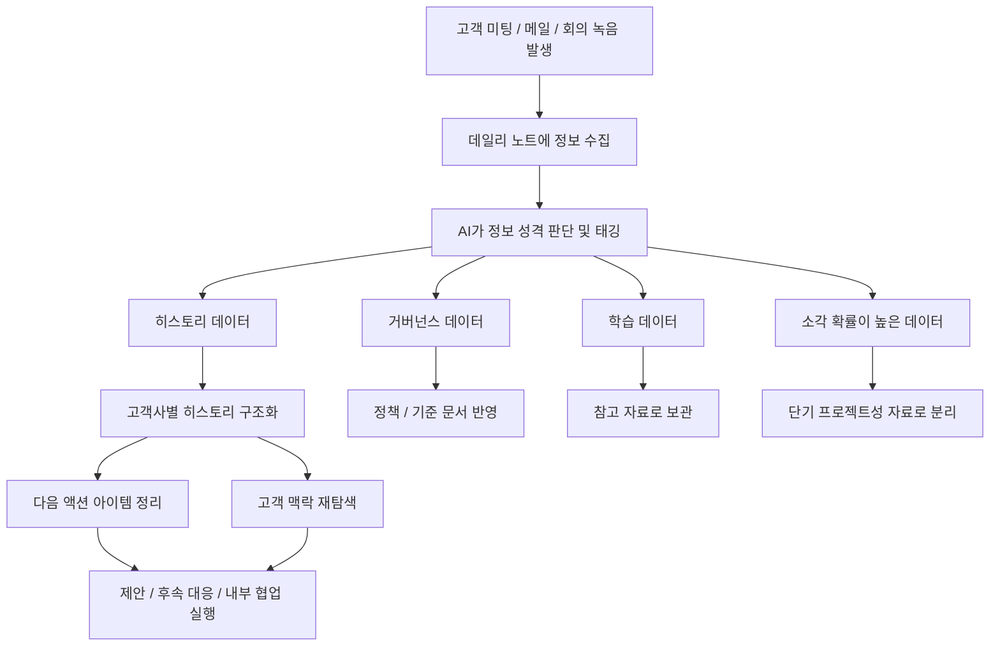

# Week 3 - AI Opportunity Mapping

## 전체 업무 흐름

## 1. 직무의 가치 정의

제가 맡고 있는 직무는 **B2B IT 솔루션 Pre-Sales**입니다. 이 직무의 핵심 가치는 고객의 요구를 단순히 듣고 전달하는 것이 아니라, **고객과의 커뮤니케이션 히스토리를 바탕으로 다음 액션을 정확하게 설계하고 내부 실행으로 연결하는 것**이라고 생각합니다.

고객사 미팅, 메일, 회의 녹음처럼 매일 쌓이는 기록 안에는 고객의 관심사, 우선순위, 우려사항, 의사결정 흐름이 모두 담겨 있습니다. 결국 Pre-Sales는 이 히스토리를 잘 이해하고 정리해서, 고객에게는 더 적절한 제안과 대응을 제공하고 내부적으로는 더 빠르고 정확한 협업이 가능하도록 만드는 역할이라고 봅니다.

이 직무가 잘 수행되면 다음과 같은 가치가 생깁니다.
- 고객과의 커뮤니케이션 맥락이 유지되어 다음 스텝이 명확해진다.
- 제안, 후속 대응, 내부 협업의 정확도가 높아진다.
- 고객 신뢰가 쌓이고 의사결정 속도가 빨라진다.

반대로 이 직무가 부족하면 다음과 같은 문제가 생깁니다.
- 이전 대화 맥락이 누락되어 고객 대응 품질이 흔들린다.
- 후속 액션이 늦어지거나 빠뜨리는 일이 발생한다.
- 내부 팀과의 정보 공유가 비효율적이어서 제안 품질이 떨어진다.

---

## 2. 직무의 성과 기준 정의

### 2-1. 정량 지표
제가 생각하는 Pre-Sales 직무의 정량 성과 지표는 아래와 같습니다.

- **미팅/메일 이후 후속 대응 리드타임**: 커뮤니케이션 이후 다음 액션까지 걸리는 시간
- **히스토리 검색 및 자료 재탐색 시간**: 과거 자료나 고객 맥락을 찾는 데 걸리는 시간
- **액션 아이템 누락 건수**: 미팅이나 메일에서 나온 후속 과제가 누락된 횟수
- **제안/보고 자료 준비 시간**: 커뮤니케이션 히스토리를 바탕으로 문서를 만드는 데 걸리는 시간
- **고객 대응 반복 작업 시간**: 정리, 분류, 저장 같은 관리성 업무에 쓰는 시간

### 2-2. 정성 지표
정성적으로는 다음 요소들이 중요하다고 생각합니다.

- **고객 커뮤니케이션의 일관성**: 담당자가 달라도 맥락이 자연스럽게 이어지는가
- **문서와 기록의 품질**: 필요한 정보가 빠지지 않고, 나중에 다시 봐도 이해 가능한가
- **협업 만족도**: 내부 팀이 필요한 정보를 빠르게 전달받는가
- **운영 안정감**: 기록 누락이나 혼선 없이 업무가 굴러가는가
- **고객 신뢰도**: 고객이 “이 팀은 우리 상황을 잘 이해하고 있다”고 느끼는가

---

## 3. 직무의 업무 분해

### 3-1. 주 업무
- 고객 미팅 및 메일 커뮤니케이션
- 고객 요구사항 파악 및 다음 액션 정의
- 제안 방향 정리 및 내부 협업 연결
- 고객별 히스토리 기반 의사결정 지원

### 3-2. 부 업무
- 미팅 내용 정리 및 회의록 작성
- 메일, 자료, 녹음 파일 정리 및 폴더 분류
- 고객사별 자료 업데이트 및 관리
- 참고 자료, 정책, 학습 자료 정리

### 3-3. 기타 업무
- 제품 및 산업 이해를 위한 학습
- 단기 프로젝트성 자료 보관 및 정리
- 사내 기준, 거버넌스 문서 참고 및 반영

### 3-4. 시간과 노력이 많이 들어가는 업무 / 실수 위험이 큰 업무
제가 실제로 가장 비효율적이라고 느낀 업무는 **커뮤니케이션 히스토리를 수동으로 정리하고 분류하는 일**입니다.

특히 아래 업무는 반복이 많고, 시간이 많이 들며, 실수 위험도 큽니다.
- 미팅 직후 회의 내용을 다시 정리하는 작업
- 메일 내용을 고객사별/주제별 폴더에 수동 분류하는 작업
- 중요한 액션 아이템이나 의사결정 포인트를 놓치지 않기 위해 재확인하는 작업
- 나중에 쓰기 위해 자료를 저장해 두지만, 실제로는 다시 찾기 어려운 상태로 쌓이는 문제

이 과정은 업무의 기반이 되기는 하지만, 그 자체가 고객 가치를 직접 만드는 본질적인 업무는 아니라고 생각합니다.

---

## 4. AI 우선 적용 영역 선정

제가 생각했을 때 AI를 가장 먼저 적용하면 효과가 큰 업무는 다음 2가지입니다.

### 4-1. 고객 커뮤니케이션 히스토리 자동 기록 및 구조화
가장 먼저 AI를 적용해야 할 영역은 **미팅, 메일, 회의 녹음 등에서 발생한 정보를 자동으로 기록하고 구조화하는 일**입니다.

Pre-Sales 업무는 결국 사람과의 관계와 흐름 위에서 이루어지기 때문에, 어떤 고객과 어떤 대화가 오갔고 그 결과 다음 스텝이 무엇인지가 매우 중요합니다. 그런데 이 히스토리를 사람이 매일 일일이 정리하는 것은 시간이 많이 들고, 놓치는 정보도 생길 수 있습니다.

그래서 저는 업무 중 발생하는 정보를 아래와 같이 태그 기반으로 나누는 방식을 먼저 정의했습니다.
- **히스토리 데이터**: 업무의 흐름을 파악하는 핵심 기록
- **거버넌스 데이터**: 회사 정책, 기준, 공통 규칙
- **학습 데이터**: 단순 참고용 공부 내용
- **소각 확률이 높은 데이터**: 단기 프로젝트성 정보

이 기준을 먼저 만들어 두면, 데일리 노트에 정보가 들어왔을 때 AI가 데이터의 성격을 판단해서 자동으로 적절한 위치에 라우팅할 수 있습니다.

### 4-2. 후속 액션 및 자료 라우팅 자동화
두 번째로 효과가 큰 영역은 **기록된 히스토리를 바탕으로 다음 액션과 저장 위치를 자동으로 정리하는 일**입니다.

예를 들어 특정 회사 이름의 폴더가 없다면 새로 만들고, 그 안에 관련 내용을 정리해서 저장하거나, 미팅 이후 해야 할 액션 아이템을 자동으로 정리해 주는 방식입니다. 이렇게 되면 단순 저장을 넘어서, 이후 제안 준비나 고객 대응 시 필요한 맥락을 훨씬 빠르게 찾을 수 있습니다.

### 4-3. 왜 이 업무에 AI가 먼저 필요하다고 생각했는가
제가 이 영역을 우선순위로 본 이유는 다음과 같습니다.

- **반복이 많다**: 매일 메일, 미팅, 문서가 계속 쌓인다.
- **시간이 많이 든다**: 정리와 분류만으로도 적지 않은 시간을 사용한다.
- **실수 위험이 크다**: 누락되거나 잘못 분류되면 이후 대응 품질이 떨어진다.
- **효과가 누적된다**: 정보 구조가 잘 잡히면 이후 검색, 제안, 협업 품질까지 함께 좋아진다.

결국 제 직무에서 AI가 가장 먼저 들어가야 할 업무는 **고객 커뮤니케이션 히스토리를 자동으로 구조화하고, 그 흐름에 맞게 다음 액션을 정리해 주는 영역**이라고 생각합니다.

입사 후 한 달 동안 저는 모든 메일과 회의 녹음 등 발생한 일들을 오늘의 노트에 모아 두고, 반복되는 패턴을 찾아 규칙을 만들었습니다. 지금은 이 규칙을 기반으로 데일리 노트에 정보만 올리면 AI가 성격을 판단해 자동 라우팅하도록 구성하고 있습니다. 그 결과 정보의 구조화가 먼저 이루어졌고, 이후 히스토리를 파악하거나 다음 대응을 준비하는 과정이 훨씬 편해졌습니다.
