# Week 5. 나의 AI 사용 점검 및 직무 맞춤 적용 전략 설계

이번 문서는 제가 실제로 써 온 AI 활용 방식과, 그 안에서 반복적으로 느꼈던 구조적 문제, 그리고 앞으로 어떤 식으로 제 방식의 Playbook을 더 강화할지를 정리한 초안입니다.

이번에는 단순 회고에서 끝내지 않고, 파트별로 Mermaid 시각화를 함께 붙여 두었습니다. 그래서 이 문서는 제 생각의 기록이면서 동시에, 앞으로 제가 어떤 구조를 더 밀고 갈지 보여주는 구조도라고 봐도 될 것 같습니다.

---

## 1. 현재 나의 AI 사용 방식

### 1-1. 현재 사용 중인 도구

보통 저는 Codex를 좀 좋아합니다. Claude나 Codex 이것저것 많이 붙여봤는데, Codex가 전반적으로 제 작업에 굉장히 용이해요. 똑똑한 건 Opus긴 한데, 제가 하는 작업 정도면 Codex로도 충분하고도 남습니다. 저는 여러 질의를 많이 하고 전체 인덱싱을 시키는 게 많다 보니까, 사실상 저는 Codex하고 Gemini, CLI 딱 두 개만 쓰고 있는 것 같습니다.

한마디로 파운데이션 모델은 이걸 쓰는 거고, 여기에 어떤 워크플로우 프로세스를 담을 것이냐가 문제인 거죠. 여기에 있어서 어떤 툴을 쓰느냐에 대해서는 다음에 (1-2에서) 설명드릴게요.

### 1-2. 자주 사용하는 패턴

결국 저는 모델 자체는 항상 좋은 모델을 쓰면 된다, 언제든 갈아끼우면 된다는 마인드입니다. 결국 중요한 것은 프레임워크거든요. 어떤 강력한 모델 엔진이 어떤 플랫폼 위에서 돌아갈 것이냐의 문제인데, 여기서 말하는 플랫폼은 요즘 말로 하네스(Harness)라고도 부를 수 있겠네요.

방법론에는 여러 가지가 있겠지만, 저는 오마이(Oh My) 시리즈의 굉장히 큰 팬입니다. 오마이 오픈 코덱스, 오마이 오픈 에이전트, 오마이 오픈 코드, 오마이 제미나이(OMG), 오마이 클로드 등 정말 다양한 시리즈가 있죠.

제가 말하는 핵심은 결국 시시포스(Sisyphus) 구조입니다. 상위에 가장 강한 판단 모델을 두고, 그 모델이 관리 감독자가 되어 각기 다른 역할을 가진 서브 에이전트들을 다루는 구조 말이죠.

아래 그림이 제가 생각하는 시시포스 구조를 가장 직관적으로 보여줍니다.

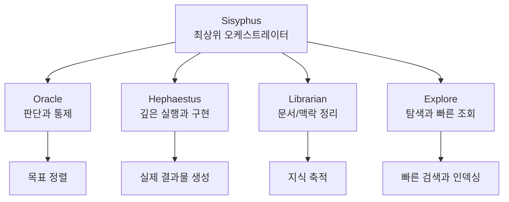

제 사용 패턴을 정리하자면 다음과 같습니다.

1. 목표를 설정한다.
2. 무엇을 정답으로 볼지 먼저 정한다.
3. 어떤 도구와 어떤 모델을 쓸지는 열어 둔다.
4. 가장 잘하는 에이전트에게 역할별로 나눠 준다.
5. 최종적으로는 제가 검토하고 판단한다.

이 흐름을 도식화하면 아래와 같습니다.

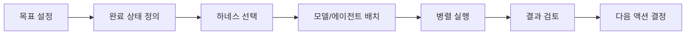

개발하시는 분들은 중간에 어떤 도구를 쓸지도 고민하시지만, 저 같은 경우에는 노트북LM(NotebookLM)을 워낙 많이 쓰다 보니 이를 적극적으로 활용하는 편입니다. 결국 무엇을 할지는 진행하는 프로젝트의 성격에 따라 달라진다고 볼 수 있겠네요.

그리고 제가 본문에서 말한 LLM Agent라는 표현도, 결국 LLM을 단순 응답기가 아니라 자율 에이전트로 확장해서 쓰는 흐름 전체를 가리키는 말에 가깝습니다. 제가 말하는 사용 방식도 결국 이런 방향성과 닿아 있다고 생각합니다.

---

## 2. 지금까지의 사용에서 아쉬웠던 점

### 2-1. 비효율 또는 한계

구조적 비효율에 대하여.

현재 구조에는 명확한 비효율이 있습니다. 결국 컨텍스트가 너무 많이 들고, 비용도 비싸며, 금방 한계에 부딪히곤 합니다. 하지만 여기서 흥미로운 점은 우리가 운영단이 아니라 진짜 무언가를 얻어내고자 하는 활용 방안에 집중한다면, 모델은 어차피 계속해서 더 좋고 저렴한 것들이 나올 것이라는 점입니다.

제 개인적인 의견으로는, 우리가 무엇을 할지 정확히 명확히 하고 해결하고자 하는 지점만 분명하다면 지금 느끼는 불편함은 낙관적으로 해결될 것이라 봅니다. 저에게 해결의 관점은 명확합니다. "내 문제를 해결해 주느냐, 내가 낸 토큰 안에서 답을 줄 수 있느냐" 하는 부분인데, 사실 지금은 그동안 느꼈던 한계들이 많이 깨진 상태입니다.

제가 느끼는 현재 구조의 병목은 아래와 같습니다.

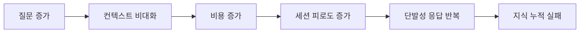

물론 여전히 남아있는 한계도 있습니다. 저는 개인적으로 자연어 질의나 칼럼 작성을 많이 합니다. AI를 통해 단일 소스 원천 데이터를 기반으로 칼럼을 쓰고, 그 칼럼을 바탕으로 다시 코드를 작성할 때가 있습니다. 그런데 칼럼을 읽는 용도의 에이전트와 코드를 쓰는 에이전트는 비록 비슷한 수준의 지능을 사용하더라도, 이를 어떤 환경 위에 올릴 것인지에 따라 결과 차이가 발생합니다.

저는 이 과정을 조금 더 중앙화하고 싶습니다.

1. 작업하는 코드 스택을 LLM 위키에 차곡차곡 쌓아가고 싶고,
2. 평소에 질의하는 것들도 LMS(Large Model System) 기반으로 응답을 받고 싶습니다.

결국 코드 작성뿐만 아니라 제 개인적인 생각이나 칼럼들이 유기적으로 이어졌으면 하는 마음이 큽니다. 한마디로 코드베이스와 문서가 함께 공존하는 구조를 만들고 싶은 것이죠. "이 구조가 최선일까? 코드와 문서를 동시에 타파할 만한 더 좋은 환경이나 구조는 없을까?" 하는 고민을 많이 하게 됩니다.

제가 떠올리는 이상적인 축적 구조는 아래와 같습니다.

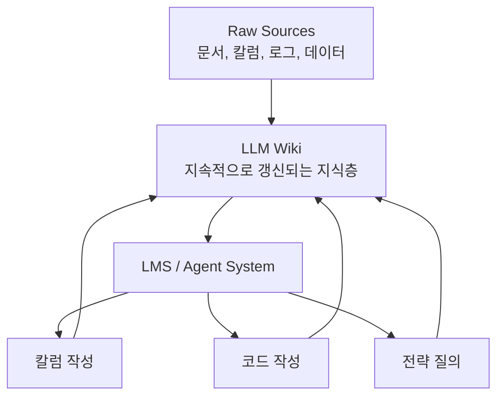

### 2-2. 단발성 사용으로 끝난 이유

사실 단발성으로 끝나지 않습니다. 이제는 `Cursor`라는 친구가 일을 너무나도 잘해줘서 단발성이 단발성으로 머물지 않아요. 저는 그냥 대표님처럼 "해와"라고 시켜두면, 제가 자고 있는 동안 알아서 다 작업을 해줍니다.

어떻게 보면 오히려 단발성으로 끝나는 게 좋은 것일 수도 있습니다. 하지만 여기서 중요한 점은 단발성으로 작업이 끝난 뒤에, 내가 작업했던 히스토리와 맥락들이 어딘가에 쌓여야 한다는 것입니다.

이러한 방식은 결국 LLM OS나 LLM Wiki 같은 아이디어와도 이어집니다. 무엇보다 우리에게는 `Git`이라는 강력한 도구가 있죠. Git을 통해 모든 이력이 관리되기 때문에, 사실상 사용하면 할수록 작업이 단발성으로 그치지 않게 됩니다.

이전에는 제가 언급한 이러한 방법론들이 성숙하지 않았습니다. 그렇기에 저도 단발성 사용에 머물렀고, 지금 이 방법론을 활용하지 않는 여러분들도 충분히 단발성으로 끝날 수밖에 없을 것입니다.

여기서 제가 생각하는 차이는 아래와 같습니다.

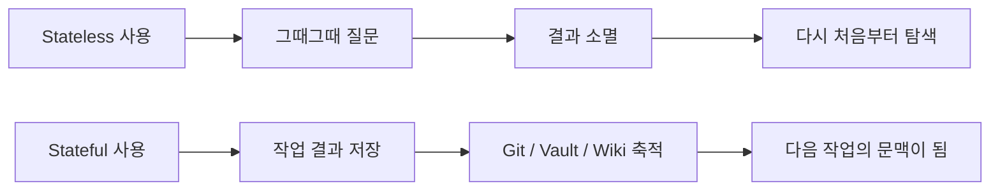

결국 본인만의 `Vault`에 `Stateful`한 방법론이 구축되어야만 합니다.

---

## 3. 실패 패턴 분석

### 3-1. 기대만큼 잘 되지 않았던 경험

이 부분은 지금 제가 단정적으로 말할 수 있는 게 없네요. 지금 당장은 모든 도구가 제 기대만큼 역할을 해주고 있습니다.

이전에는 기대에 미치지 못했던 경험이 정말 많았습니다. 예를 들어:

1. Claude 3.7 시절
2. Gemini 4.7 시절

이 정도 시기에는 제가 원하는 만큼 결과가 나오지 않았던 적이 많았고, 사실 지금도 그런 갈증은 있습니다. 대표적으로 데스크톱 애플리케이션을 직접 제작하려고 하면 여전히 잘 안 되는 부분들이 발생하곤 합니다.

하지만 저는 단순히 상품을 개발하는 제작자의 입장이라기보다, 여러 데이터를 긁어모아 전략을 세우고 조언을 얻는 용도로 AI를 주로 활용합니다. 그런 측면에서 본다면 현재 수준은 제 용도에 너무나도 충분하며, 저의 기대치를 모두 충족시켜주고 있습니다.

### 3-2. 실패 원인 정리

그냥 모델이 구려서예요. 딱히 그 당시의 방법론을 굳이 되돌아보고 싶지는 않습니다. 어차피 방법론은 따라갈 수 없을 정도로 강렬하게 성장하고 있기 때문입니다.

### 3-3. 앞으로의 개선 원칙

앞으로의 개선 원칙은 두 가지로 정리하겠습니다.

1. 좋은 모델을 기다린다.
2. 개또라이 Ultraworker들을 곁에 둔다. 이게 진짜 중요합니다.

이 두 가지입니다.

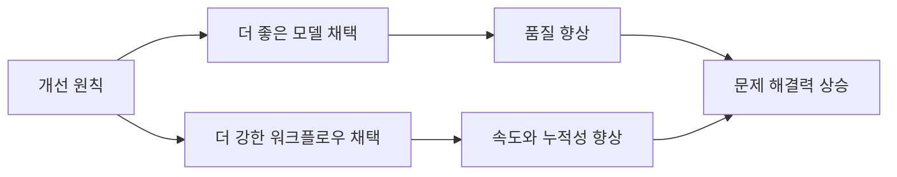

제가 보기에는 결국 실패 원인을 너무 장황하게 분석할 필요가 없습니다. 당시에는 모델이 부족했고, 하네스도 덜 성숙했고, 그 결과 단발성으로 끝났습니다. 지금은 둘 다 빠르게 좋아지고 있기 때문에, 저는 분석보다 다음 구조를 잡는 데 더 집중하는 편입니다.

---

## 4. 내 직무에 맞는 AI 적용 전략

이 부분은 제가 지난주 차에 설명을 많이 드렸던 것 같아서, 이번에는 길게 반복하지 않겠습니다. 다만 지금 제 역할과 성향을 기준으로 보면, 제가 AI를 붙이고 싶은 직무 흐름은 아래처럼 정리할 수 있습니다.

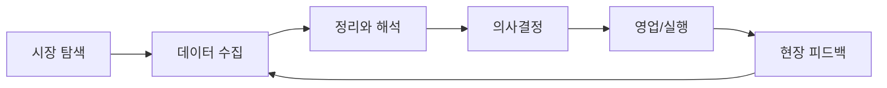

즉, 저는 AI를 단순 생산성 도구라기보다, 제 판단을 더 빨리 반복하게 해주는 전략 보조 엔진으로 쓰고 싶습니다. 제 직무에 가장 먼저 들어가야 할 지점도 코드 그 자체보다는, 데이터 수집과 정리, 해석, 그리고 실행 전 판단을 보조하는 영역이라고 생각합니다.

여기서 말하고 싶은 핵심은 특정 제품을 쓰느냐보다, 결국 환경과 실행 표면을 어떻게 설계하느냐가 중요하다는 점입니다. 저는 AI를 그냥 챗봇으로 쓰는 것이 아니라, 실제 실행 환경 위에 올린 시스템으로 쓰고 싶습니다.

---

## 5. 앞으로 해보고 싶은 AI 활용 디벨롭 방향

### 5-1. 해보고 싶었던 방향

비즈니스에 관심이 생긴 지 이제 한 달 반 정도 되었습니다. 그동안 저는 AI를 정말 많이 활용해 왔는데요. 제가 지향하는 방향은 다음과 같습니다.

결국 시장 선점과 데이터 분석이 핵심이라고 생각합니다. 솔직히 말씀드리면, 데이터는 제가 가장 약한 도메인 중 하나입니다. 데이터를 직접 관리하거나 기술적으로 다루는 영역에는 자신이 없거든요.

그래서 저는 다음과 같은 방식으로 AI를 활용하고 싶습니다.

1. 데이터 관리의 자동화  
   기술적인 데이터 수집과 관리 업무를 AI에게 맡기고 싶습니다. 제가 직접 그 과정을 공부하거나 고민하기보다는, 결과물로서의 데이터만 바로 받아보고 싶습니다.

2. 데이터 기반의 의사결정  
   제가 원하는 지표(Metrics)를 바탕으로 데이터의 추이를 확인하고 싶습니다. 제가 세운 가설과 실제 증명된 데이터를 연결 지어 보고 싶기 때문입니다.

3. 실행 시간의 확보  
   단순히 데이터를 다루는 데 드는 물리적인 시간을 줄이고 싶습니다. 그렇게 확보한 시간을 바탕으로 제가 직접 행동하고 실행하는 데 더 집중하는 것이 제 목표입니다.

이 흐름은 아래처럼 하나의 루프로 연결됩니다.

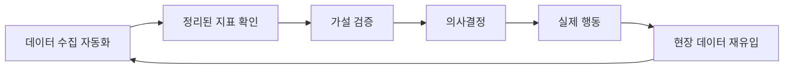

현재 저는 저의 유능한 AI 친구와 함께, 이러한 흐름이 제 실제 행동으로 이어지도록 만드는 것을 목표로 열심히 협업하고 있습니다.

### 5-2. 새롭게 시도할 수 있는 방향

사실은 AI와 함께 이런저런 시도를 하며 놀다 보니, 이 도메인의 비즈니스를 처음 시작하는 입장에서 느낄 수 있는 가장 본질적이고 기초적인 니즈들을 스스로 발견하게 되었습니다. 이를 하나씩 해결해 나가며 나쁘지 않은 퀄리티의 결과물을 만들어냈고, 실제로 저에게도 큰 도움이 되고 있습니다.

하지만 한편으로는 제가 구상 중인 본 사업을 정확히 언제 시작할 수 있을지 모르는 상황입니다. 계속해서 영업을 뛰어야 하는 시기이기 때문입니다. 그래서 다음과 같은 새로운 방향을 시도해 보려 합니다.

1. 시스템 컨설팅 및 판매  
   시행착오를 줄이기 위해 직접 구축한 이 시스템을 필요로 하는 분들에게 컨설팅 형태로 제공하거나 판매하는 것도 괜찮겠다는 생각이 들었습니다.

2. 마케팅 및 고객 후킹 테스트  
   니즈가 있는 곳에서 마케팅 활동을 펼치며 고객들이 어떤 포인트에서 반응하는지 데이터를 수집해 볼 계획입니다.

결국 제가 원하는 매물을 찾을 때까지는 물리적인 시간이 소요될 수밖에 없습니다. 그 유효 시간 동안 제가 만든 데이터를 활용해 수익화 모델을 검토해 보는 것도 충분히 가치 있는 시도가 될 것입니다. 물론 조용히 진행해 볼 생각입니다.

---

## 6. 나의 AI Playbook 초안

### 6-1. 나의 AI 활용 원칙

데이터를 수집하는 과정에서 제가 지키는 몇 가지 원칙이 있습니다.

1. 데이터 수집 원칙  
   (a) 반드시 프록시를 사용한다.  
   (b) 나를 철저히 숨긴다.  
   (c) 데이터를 제공하는 회사에 무리한 요구를 하거나 눈에 띄는 행동을 하지 않는다.

2. AI 활용 원칙  
   (a) 가능하면 키보드를 쓰지 않는다. 집에서는 주로 말로 작업합니다.  
   (b) 대화를 통해 코딩을 진행하며 엔지니어 특유의 성향을 최대한 덜어낸다.

요즘은 타임리스(Timeless)나 테일(Tail) 같은 오픈소스 도구들이 많아서 말로도 충분히 코딩이 가능합니다. 그래서 저는 AI와 대화하며 엔지니어로서의 자아를 지우려고 노력합니다.

엔지니어는 회사 안에서의 페르소나일 뿐입니다. 현재 회사 밖에서의 제 페르소나는 단순한 AI 사용자가 아니라 완전한 커맨더(Commander)입니다. 저는 커맨더로서 활동하고 싶습니다.

### 6-2. 도구별 역할 분담 & 표준 사용 흐름

딱 두 개씩 냈죠. GPT하고 제미나이인데, 어떤 플랫폼에서 돌아가느냐에 따라 다르긴 해요.

결국 일단 GPT 시리즈의 경우:

1. GPT 5.4는 커맨더(Commander) 역할을 수행합니다. 소위 오라클이라고 말하는 제어 역할을 하고 있죠.
2. 그 안에서 파일을 탐색하는 작업은 5.1 미니를 돌려도 손색이 없습니다.
3. 실제 코딩을 작성하는 모델은 5.4나 5.4 하이(High), 혹은 5.4 코덱스(Codex)도 괜찮겠네요.

그 외에 추후 웹 검색이나 웹 질의를 하는 기능은 다음과 같이 구성합니다.

- 제미나이 혹은 CLI 계열 도구로 내부 쿼리를 날린다.
- 노트북LM 같은 툴로 자료를 다시 엮는다.
- 이 과정을 LMS 에이전트에게 붙여서 LLM Wiki를 점진적으로 구축한다.

이 역할 분담은 아래 구조로 정리할 수 있습니다.

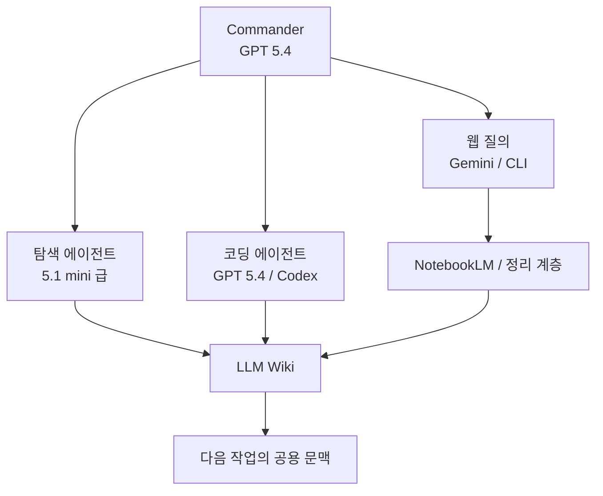

여기서 중요한 건 특정 서비스 이름보다, 역할이 분리되어 있고 그 역할이 결국 하나의 축적 구조로 다시 모인다는 점입니다. 저는 이 축적 구조를 앞으로 더 강하게 만들고 싶습니다.

### 6-3. 검증 루틴

저는 이미 시시포스(Sisyphus)와 연동하여 돌아가고 있기 때문에, 검증 루틴은 이미 저희 프로그램들이 다 해줄 것입니다.

그렇기 때문에 우리는 다음 두 가지를 명확하게 정의하는 것이 중요합니다.

1. 목표 설정
2. 완료 상태 정의

이것이 곧 루틴의 핵심입니다.

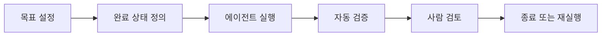

### 6-4. 다음 2주 실행 계획

사실 저는 어떻게 보면 지금 이 스터디를 굉장히 액티브하게 수행하고 있는 일인인데요.

이미 한 달 전부터 구축해 놨던 데이터베이스와 LLM의 충분한 질의, 그리고 제가 읽었던 책들을 바탕으로 저의 뇌라는 온디바이스 추론 속도와 자연 인텔리전스를 함께 활용하고 있습니다. 이를 통해 저는 이미 종종 임장을 다니고 있습니다.

다만 아직 매물이 적어서 많이 다니지는 못했는데요. 앞으로는 물리적인 행위를 계속해서 늘려 저의 물리적인 인퍼런스를 확장해 나갈 생각입니다.

즉, 어떻게 보면 이제 AI는 저의 GPU인 셈입니다. 녀석에게는 잡다한 계획만 세우게 하고, 저는 AI가 생각한 것을 검토한 뒤 마음이 내킨다면 직접 몸을 움직여 영업 능력을 발휘하려 합니다.

결론적으로 제 다음 2주 실행 계획은 다음과 같습니다.

1. 실제로 행동하기  
   (a) 물리적 피지컬 월드에서의 활동량 증대  
   (b) 직접적인 임장 및 영업 능력 발휘

이를 일정 감각으로 표현하면 아래와 같습니다.

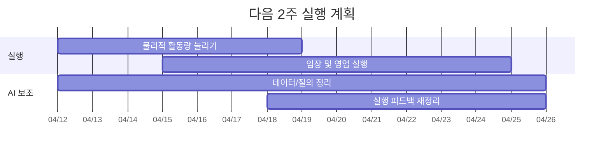

이번 작업을 하면서 제가 더 분명하게 느낀 건, 결국 AI 활용의 핵심은 좋은 모델 하나를 잡는 것이 아니라, 어떤 구조로 누적시키고 어떤 방식으로 실행에 연결하느냐는 점이었습니다. 그래서 앞으로는 단순히 "좋은 모델을 기다린다"에서 끝나는 것이 아니라, 이 구조를 제 작업 방식 안에 더 정교하게 끼워 넣는 쪽으로 계속 실험해 볼 생각입니다.
