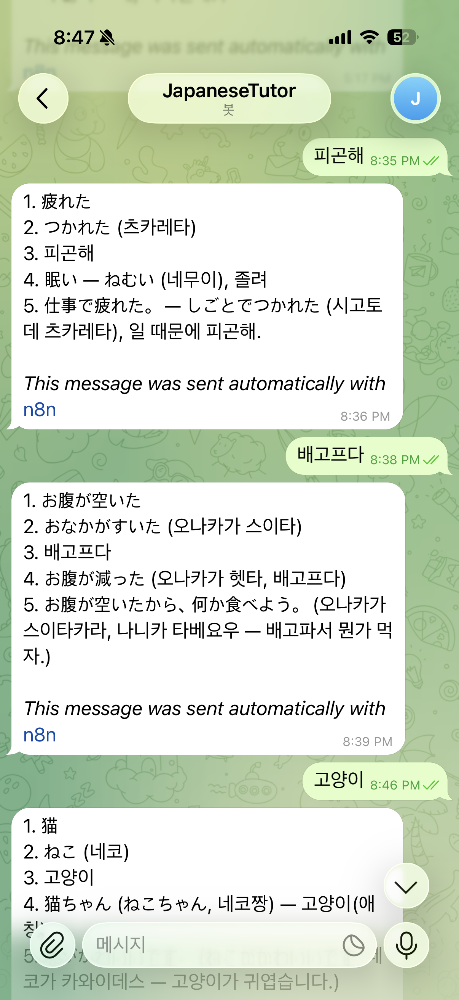

# 나의 AI Playbook (개인용)
## 6-1. 나의 AI 활용 원칙
1. 입력
- 명확한 요구사항과 맥락을 함께 전달한다
- 막연하게 질문하지 않는다. 목적을 먼저 정리한다.
- 카테고리화, 분류화

2. 검증
- 결과를 그대로 사용하지 않고 반드시 검증한다

3. 저장
- 가능한 반복 가능한 형태로 축적한다

## 6-2. 도구별 역할 분담
- GPT: 고민상담, 아이디어 확장
- Gemini: 정보 탐색 및 빠른 비교, 보조 검증 용도
- Claude: 프로그래밍
- MSCopilot: PPT 제작, 코드 검색
- Perplexity: 웹서핑

## 6-3. 표준 사용 흐름
- 프로젝트별로 분리하여 용도별로 프롬프트를 활용한다
- 구조화 및 검증 과정을 거친다


# 나만의 AI Agent 만들기 - n8n 일본어 학습 자동화

## 개요

Telegram에 한국어 문장을 입력하면
AI가 일본어로 변환 + 학습 정보 제공 후 다시 Telegram으로 답장하는 자동화 시스템

## 전체 구조

```
Telegram Trigger → OpenAI → Telegram Send Message → 노션 정리
```

## 사전 준비

### 1. Telegram 봇 생성

* Telegram에서 **BotFather** 검색
* `/start` → `/newbot`
* 봇 이름 & username 설정 (`~bot` 필수)
* 발급된 **Bot Token 복사**

### 2. n8n 설정

* Telegram Credential 생성 (Bot Token 입력)
* OpenAI API Key 연결

## n8n 워크플로우 구성

### 1. Telegram Trigger 노드

**역할:** 사용자 입력 받기

**설정**

* Resource: `Message`
* Updates: `message`
* Credential: Telegram Bot 연결

### 2. OpenAI 노드

**역할:** 일본어 변환 + 학습 콘텐츠 생성

**Model**

```
gpt-4o-mini
```

**System Message**

```
너는 일본어 튜터야.

입력 문장을 자연스럽게 일본어로 바꾸고,
아래 형식으로 간결하게 출력해.
일본어일 경우 그대로 출력해.

1. 일본어
2. 히라가나 발음
3. 한국어 뜻
4. 비슷한 표현 1개 (한국어 발음, 한국어 해석 포함)
5. 예문 1개 (한국어 발음, 한국어 해석 포함)
```

**Prompt (User Message)**

```
{{$json.message.text || "테스트 문장"}}
```

### 3. Telegram Send Message 노드

**역할:** AI 결과를 사용자에게 전송

**테스트:**
1. n8n에서 `Execute Workflow` 클릭
2. Telegram에서 봇에게 메시지 전송
3. 결과 확인

### 4. 노션 저장 노드

**역할:** 노션 DB에 일본어 쿼리 결과를 저장
**테스트:**
1. n8n에서 `Execute Workflow` 클릭
2. 노션에 데이터가 저장되는지 결과 확인

### 실제 자동화

* 워크플로우 상단 **Activate ON**
* 이후부터 Telegram 입력 시 자동 실행


## ✅ 사용 예시


