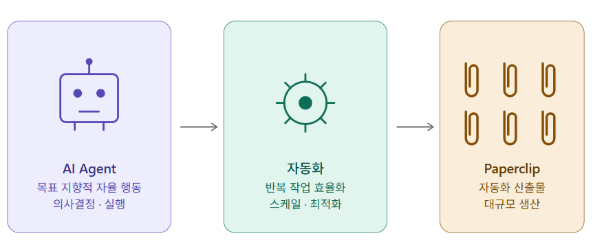
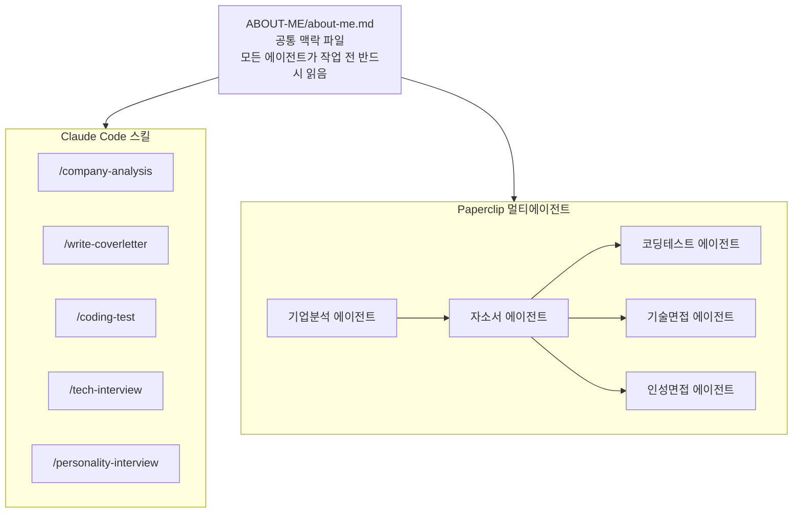

# 데이터엔지니어 취업준비 자동화 시스템

> 기업 공고 하나를 넣으면 기업분석 → 자소서 → 코딩테스트 + 면접 준비까지 자동으로 흘러가는 AI 파이프라인

---

## 왜 만들었나

| 기존 방식의 문제 | 이 시스템의 해결 |
|---|---|
| "~해줘" 한 줄 프롬프트 — AI가 내 상황을 모름 | `ABOUT-ME/about-me.md` 를 공통 맥락으로 모든 에이전트에 자동 주입 |
| 결과물이 대화창 안에만 남음 | 모든 출력을 날짜 포함 마크다운 파일로 자동 저장 |
| 같은 작업을 매번 처음부터 | 5단계 파이프라인이 순서대로 자동 인계 |
| AI가 만든 경험을 검증 없이 수용 | 실제 경험 파일 기반 작성, AI 생성 경험 금지 규칙 내장 |

---

## 시스템 구조

---

## Paperclip 에이전트 구성

| 에이전트 | 모델 | 모델 선택 이유 |
|---|---|---|
| 기업분석 | claude-sonnet-4-6 | 웹검색·재무 조회·JD 심층 분석 — 복잡한 추론 필요 |
| 자소서 | claude-sonnet-4-6 | 실제 경험을 STAR 구조로 녹이는 글쓰기 품질이 결과물에 직결 |
| 코딩테스트 | claude-haiku-4-5 | 문제 생성·코드 리뷰는 정해진 패턴 — 속도·비용 우선 |
| 기술면접 | claude-haiku-4-5 | 예상 질문 생성·모의 면접은 반복 패턴, 턴 수 많아 비용 절감 효과 큼 |
| 인성면접 | claude-haiku-4-5 | 기술면접과 병렬 실행 시 Sonnet 대비 비용 약 1/5 |

각 에이전트는 `AGENTS.md`(역할·성공 기준·규칙)로 정의된다.  
기업분석 에이전트는 추가로 `SOUL.md`(정체성·핵심 가치), `TOOLS.md`(도구·쿼리 패턴), `HEARTBEAT.md`(Task 수신 시 즉시 실행 체크리스트)를 갖는다.

---

## AI 활용 원칙

1. **맥락을 파일로 관리** — `ABOUT-ME/about-me.md`가 지원자 프로필 단일 소스. 모든 스킬이 이 파일을 먼저 읽는다.
2. **AI 출력은 초안** — 사실 확인 → 수정 → Git 저장까지가 작업의 완료다.
3. **AI가 만든 경험은 쓰지 않는다** — 자소서·면접 답변에는 실제 경험과 수치만 사용한다.
4. **도구를 목적에 맞게 나눈다** — Claude Code(파일 맥락 기반 단계별 작업) + Paperclip(파이프라인 자동화 시각화).

---

